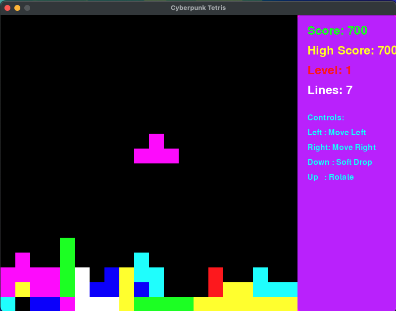

# Tetris

A cyberpunk-themed Tetris game with vibrant neon aesthetics, built using Python and Pygame.



## Features

- Dazzling neon color scheme
- Particle effects for line clears
- Dynamic scoreboard with high score tracking
- Progressive difficulty levels
- Cyberpunk-inspired visuals and sound effects
- Pause/Resume functionality

## Quick Start

1. Clone the repo:

   ```
   git clone https://github.com/JoeBuydemDips/tetris.git
   ```

2. Install dependencies:

   ```
   pip install pygame
   ```

3. Run the game:
   ```
   python main.py
   ```

## How to Play

Stack the falling tetrominoes to create complete horizontal lines. Clear lines to score points and prevent the stack from reaching the top of the screen.

### Controls

- ←/→: Move left/right
- ↓: Soft drop
- ↑: Rotate piece
- Space: Pause/Resume

## Technical Details

- `main.py`: Game entry point
- `game.py`: Core game logic
- `tetromino.py`: Tetromino piece definitions
- `particle.py`: Special effects system
- `constants.py`: Game constants and colors

## Advanced Features

- **Dynamic Difficulty**: Speed increases as you level up
- **Particle System**: Enjoy a burst of particles with each line clear
- **Pause Functionality**: Take a break without losing your progress

## Contributing

Contributions are welcome! Feel free to submit issues or pull requests.

## License

This project is open source, available under the [MIT License](LICENSE).
